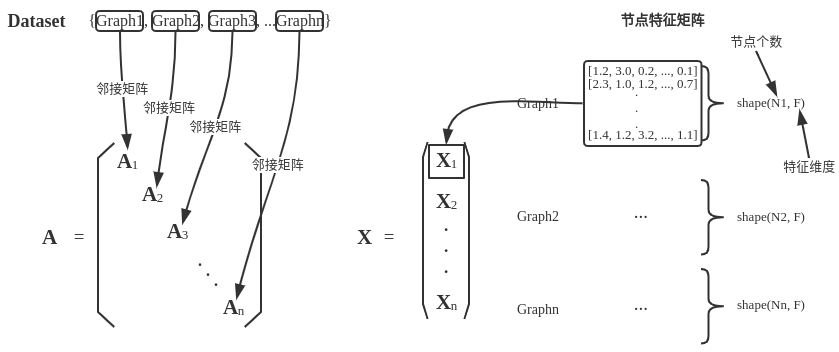
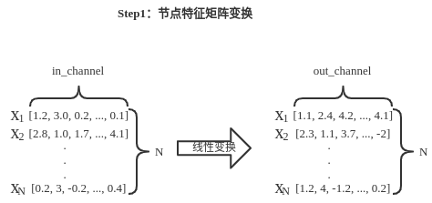
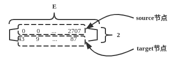
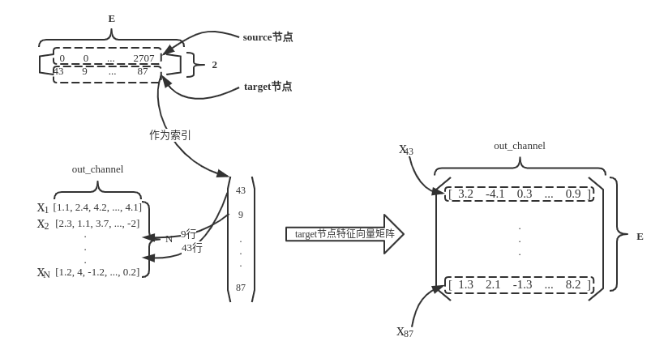
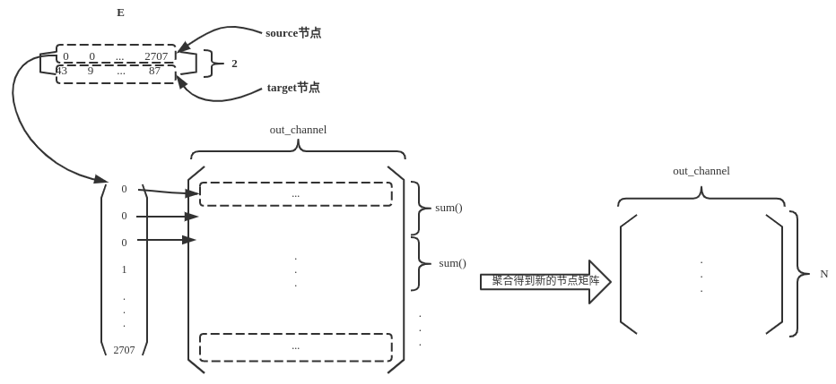

## PyG

[TOC]

### PyG相关链接

+ [项目地址](https://github.com/rusty1s/pytorch_geometric)
+ [Document](https://pytorch-geometric.readthedocs.io/en/latest/notes/installation.html)

### Graph数据处理

在PyG中，单个graph定义为`torch_geometric.data.Data`实例，默认有以下属性：

+ `data.x`：节点特征矩阵，shape为`[num_nodes, num_node_features]`。
+ `data.edge_index`：COO格式的graph connectivity矩阵，shape为`[2, num_edges]`，类型为`torch.long`。
+ `data.edge_attr`：边的特征矩阵，shape为`[num_edges, num_edge_features]`。
+ `data.y`：训练的target，shape不固定，比如，对于node-level任务，形状为`[num_nodes, *]`，对于graph-level任务，形状为`[1, *]`。
+ `data.pos`：节点的位置(position)矩阵，shape为`[num_nodes, num_dimensions]`。

**这些参数都不是必须的，而且，`Data`类也不仅仅限制于这些参数**。

**例子**：对于一个不带权重的无向图，有三个节点和四条边，每一个节点的特征维度为1，如下图


> **注意**：这里一条无向边使用两条边(节点对)表示，比如对于节点`0`和`1`，无向边表示为`(0,1)`和`(1,0)`。

```python
import torch
from torch_geometric.data import Data

edge_index = torch.tensor([[0, 1, 1, 2],
                           [1, 0, 2, 1]], dtype=torch.long)
x = torch.tensor([[-1], [0], [1]], dtype=torch.float)

data = Data(x=x, edge_index=edge_index)
>>> Data(edge_index=[2, 4], x=[3, 1])
```

对于`edge_index`参数，shape为`(2,4)`，4表示边的条数，对于`x`参数，shape为`(3,1)`，3表示节点数，1表示节点特征维度。

`Data`类也有其对应的方法和属性，说明如下：

+ `data.keys`：返回属性名列表。
+ `data['x']`：返回属性名为`'x'`的值。
+ `for key, item in data: ...`：按照字典的方法返回key的value。
+ `'x' in data`：判断某一属性是否在data中。
+ `data.num_nodes`：返回节点个数，相当于`edge_index.shape[1]`。
+ `data.num_edges`：返回边的条数，相当于`x.shape[0]`。
+ `data.contains_isolated_nodes()`：是否存在孤立的节点。
+ `data.contains_self_loops()`：是否存在自环。
+ `data.is_directed()`：是否是有向图。
+ `data.to(torch.device('cuda'))`：将数据对象转移到GPU。

### 常见Benchmarks数据集

PyG包含有大量的基准数据集。初始化数据集非常简单，**数据集初始化会自动下载原始数据文件，并且会将它们处理成上述的`Data`格式**，比如，对于加载`ENZYMES`数据集，包含有600个graphs，有6个类别：

```python
from torch_geometric.datasets import TUDataset

dataset = TUDataset(root='/tmp/ENZYMES', name='ENZYMES')
>>> ENZYMES(600)

len(dataset)
>>> 600

dataset.num_classes
>>> 6

dataset.num_node_features
>>> 3
```

可以**通过索引的方式**来访问数据集中的数据

```python
data = dataset[0]
>>> Data(edge_index=[2, 168], x=[37, 3], y=[1])

data.is_undirected()
>>> True
```

上面的输出表示，第一个graph包含有37个节点，每个节点特征维度为3，有$\frac{168}{2}=84$条无向边，并且该graph的标签(类别)为`1`。

还可以**使用slices的方式对数据集进行分割**，比如创建训练集和测试集

```python
train_dataset = dataset[:540]
>>> ENZYMES(540)

test_dataset = dataset[540:]
>>> ENZYMES(60)
```

**使用`shuffle()`方法对数据集进行打乱**

```
dataset = dataset.shuffle()
>>> ENZYMES(600)
```

用另外一个数据集Cora为例，该数据集用于semi-supervised的节点分类任务

```python
from torch_geometric.datasets import Planetoid

dataset = Planetoid(root='/tmp/Cora', name='Cora')
>>> Cora()

len(dataset)        # 只包含一个graph
>>> 1

dataset.num_classes # 节点类别个数为7
>>> 7

dataset.num_node_features  # 节点特征维度为1433
>>> 1433
```

这个数据集只包含一个无向图

```python
data = dataset[0]
>>> Data(edge_index=[2, 10556], test_mask=[2708],
         train_mask=[2708], val_mask=[2708], x=[2708, 1433], y=[2708])

data.is_undirected()         # 图是无向图
>>> True

data.train_mask.sum().item() # 训练集节点
>>> 140

data.val_mask.sum().item()   # 验证集节点
>>> 500

data.test_mask.sum().item()  # 测试集节点
>>> 1000
```

这个`Data`对象中有如下属性

+ `edge_index`：有10556/2=5278条边。
+ `train_mask`：训练集的mask向量，标识哪些节点属于训练集。
+ `val_mask`：验证集的mask向量，标识哪些节点属于验证集。
+ `test_mask`：测试集的mask向量，表示哪些节点属于测试集。
+ `x`：输入的特征矩阵。
+ `y`：节点标签。

### Mini-batches操作

PyG通过创建一个稀疏的块对角矩阵来实现并行化操作，并在节点的维度将节点特征矩阵和target矩阵连接起来。这种方式使得比较容易地在不同的batch中进行操作
$$
\begin{split}\mathbf{A} = \begin{bmatrix} \mathbf{A}_1 & & \\ & \ddots & \\ & & \mathbf{A}_n \end{bmatrix}, \qquad \mathbf{X} = \begin{bmatrix} \mathbf{X}_1 \\ \vdots \\ \mathbf{X}_n \end{bmatrix}, \qquad \mathbf{Y} = \begin{bmatrix} \mathbf{Y}_1 \\ \vdots \\ \mathbf{Y}_n \end{bmatrix}\end{split}
$$

以第一个数据集为例，生成batch的代码如下

```python
from torch_geometric.datasets import TUDataset
from torch_geometric.data import DataLoader

dataset = TUDataset(root='/tmp/ENZYMES', name='ENZYMES', use_node_attr=True)
loader = DataLoader(dataset, batch_size=32, shuffle=True)

for batch in loader:
    batch
    >>> Batch(batch=[1082], edge_index=[2, 4066], x=[1082, 21], y=[32])

    batch.num_graphs
    >>> 32
```

其中关于batch说明如下：

+ `edge_index`：连接的边

+ `x`：整个batch的节点特征矩阵

+ `y`：graph标签

+ `batch`：列向量，用于指示每个节点属于batch中的第几个graph 
  $$
  \mathrm{batch} = {\begin{bmatrix} 0 & \cdots & 0 & 1 & \cdots & n - 2 & n -1 & \cdots & n - 1 \end{bmatrix}}^{\top}
  $$
  可以使用该向量来实现对每个graph的节点特征求平均。

关于$\mathbf{A}$变量和$\mathbf{X}$变量的说明示意图如下



$\mathbf{A}$矩阵的对角线上每一个矩阵块分别是对应graph的邻接矩阵，$\mathbf{X}$矩阵中的每一个矩阵块，分别是对应graph的节点特征矩阵，然后叠加起来。由于第$i$个graph的邻接矩阵大小为$(N_i,N_i)$，所以，$\mathbf{A}$矩阵的行数和列数都是$\sum^n_{i=1}N_i$，其中，$N_i$表示第$i$个graph的节点个数。

> 这种mini-batch的操作本质上来说是将一个batch的graph看成是一个大的graph，由此，无论batch size是多少，其将所有的操作都统一在一个大图上进行操作。

### Data Transforms

在`torchvision`中，Transforms是用于对图片进行转换和增强。PyG同样有它自己的Transforms，该方法输入`Data`对象，转化后输出新的`Data`对象，Transforms还可以通过`torch_geometric.transforms.Compose`来组合多个转换操作。Transforms操作可以在保存数据集到disk之前或者访问数据集中的graph之前进行实现。

比如从点云数据集产生最近邻图，使用transforms代码如下

```python
import torch_geometric.transforms as T
from torch_geometric.datasets import ShapeNet

dataset = ShapeNet(root='/tmp/ShapeNet', categories=['Airplane'],
                    pre_transform=T.KNNGraph(k=6))

dataset[0]
>>> Data(edge_index=[2, 15108], pos=[2518, 3], y=[2518])
```

这里是在下载数据集时实现的transforms，下一次再次从disk中访问这个数据集时，就是已经被transform了的数据。

另外，还可以使用`transform`参数来对`Data`对象进行随机的增强操作

```python
import torch_geometric.transforms as T
from torch_geometric.datasets import ShapeNet

dataset = ShapeNet(root='/tmp/ShapeNet', categories=['Airplane'],
                    pre_transform=T.KNNGraph(k=6),
                    transform=T.RandomTranslate(0.01))

dataset[0]
>>> Data(edge_index=[2, 15108], pos=[2518, 3], y=[2518])
```

### 在Graph上训练

在前面处理好dataset，dataloader和transform之后，就可以开始实现GNN了。以GCN模型和Cora节点分类任务为例，实现代码如下

+ 加载数据集

  ```python
  from torch_geometric.datasets import Planetoid
  
  dataset = Planetoid(root='/tmp/Cora', name='Cora')
  >>> Cora()
  ```

  由于是node-focused的任务，暂不考虑transforms和dataloader

+ 实现两层GCN

  ```python
  import torch
  import torch.nn.functional as F
  from torch_geometric.nn import GCNConv
  
  class Net(torch.nn.Module):
      def __init__(self):
          super(Net, self).__init__()
          self.conv1 = GCNConv(dataset.num_node_features, 16)
          self.conv2 = GCNConv(16, dataset.num_classes)
  
      def forward(self, data):
          x, edge_index = data.x, data.edge_index
  
          x = self.conv1(x, edge_index)
          x = F.relu(x)
          x = F.dropout(x, training=self.training)
          x = self.conv2(x, edge_index)
  
          return F.log_softmax(x, dim=1)
  ```

  可以看出，在`__init__()`中定义网络层，在`forward()`中实现前向传播过程，激活函数使用`relu`。

+ 训练模型

  ```python
  device = torch.device('cuda' if torch.cuda.is_available() else 'cpu')
  model = Net().to(device)
  data = dataset[0].to(device)
  optimizer = torch.optim.Adam(model.parameters(), lr=0.01, weight_decay=5e-4)
  
  model.train()
  for epoch in range(200):
      optimizer.zero_grad()
      out = model(data)
      loss = F.nll_loss(out[data.train_mask], data.y[data.train_mask])
      loss.backward()
      optimizer.step()
  ```

  该模型训练200个epoch，loss函数使用`nll_loss`。

+ 在测试集节点上评估模型

  ```python
  model.eval()
  _, pred = model(data).max(dim=1)
  correct = float(pred[data.test_mask].eq(data.y[data.test_mask]).sum().item())
  acc = correct / data.test_mask.sum().item()
  print('Accuracy: {:.4f}'.format(acc))
  >>> Accuracy: 0.8150
  ```

## 构建Message Passing Networks

将卷积操作扩展到无规则数据结构领域，可以表示为`neighborhood aggregation`或者`message passing`模式。$\mathbf{x}^{(k-1)}_i \in \mathbb{R}^F$表示在$(k-1)$层的第$i$个节点的特征向量，$\mathbf{e}_{i,j} \in \mathbb{R}^D$(optional)表示从节点$i$到节点$j$的边的特征向量，MPGNN可以表示为
$$
\mathbf{x}_i^{(k)} = \gamma^{(k)} \left( \mathbf{x}_i^{(k-1)}, \square_{j \in \mathcal{N}(i)} \, \phi^{(k)}\left(\mathbf{x}_i^{(k-1)}, \mathbf{x}_j^{(k-1)},\mathbf{e}_{i,j}\right) \right),
$$
其中，$\square$表示可导的、与输入顺序无关的函数，比如求和、求平均或取最大值，$\gamma$和$\phi$表示可导的函数，比如MLP(多层感知机)。

### PyG中"MessagePassing"类

PyG提供`torch_geometric.nn.MessagePassing`基类，用于创建这种MPGNN模型，构建自定义的MPNN时，只需要定义函数$\phi$(即`message()`)和$\gamma$(即`update()`)，以及信息聚合模式，比如`aggr='add'`，`aggr='mean'`或者`aggr='max'`。

PyG通过如下方法实现上述功能：

+ `torch_geometric.nn.MessagePassing(aggr="add",flow="source_to_target")`定义了聚合模式(`aggr`)以及信息的流动方向(`flow`)。
+ `torch_geometric.nn.MessagePassing.propagate(edge_index,size=None,**kwargs)`函数输入边的indices和所有需要的数据，用于构建信息以及对节点的embedding进行更新。
+ `torch_geometric.nn.MessagePassing.message()`类似于函数$\phi$构建传递到节点$i$的信息，能够接受任何传递给`propagate()`函数的参数，另外，可以通过在节点$i$后加入后缀`_i`来将特征映射到对应的节点，比如使用`x_i`表示节点$i$的特征向量。
+ `torch_geometric.nn.MessagePassing.update()`用于对每个节点$i \in \mathcal{V}$以类似于函数$\gamma$的方式来更新节点的embedding，该函数接受信息聚合函数的输出作为第一个输入参数，以及任意的最初传递给`propagate()`的参数。

#### 实现GCN Layer

GCN层定义如下
$$
\mathbf{x}_i^{(k)} = \sum_{j \in \mathcal{N}(i) \cup \{ i \}} \frac{1}{\sqrt{\deg(i)} \cdot \sqrt{deg(j)}} \cdot \left( \mathbf{\Theta} \cdot \mathbf{x}_j^{(k-1)} \right),
$$
其中，将邻居节点特征先通过权重矩阵$\mathbf{\Theta}$进行变换，然后使用节点的度进行归一化，最后再求和，这个公式可以分解为以下步骤：

1. 增加自连接到邻接矩阵，即邻接矩阵的对角线元素为1。
2. 对节点的特征矩阵进行线性变换。
3. 使用函数$\phi$对节点特征进行规范化。
4. 对邻居节点特征进行聚合操作。
5. 通过函数$\gamma$返回新的节点embedding

整个实现的代码如下：

```python
import torch
from torch_geometric.nn import MessagePassing
from torch_geometric.utils import add_self_loops, degree

class GCNConv(MessagePassing):
    def __init__(self, in_channels, out_channels):
        super(GCNConv, self).__init__(aggr='add')  # "Add" aggregation.
        self.lin = torch.nn.Linear(in_channels, out_channels)

    def forward(self, x, edge_index):
        # x has shape [N, in_channels]
        # edge_index has shape [2, E]

        # Step 1: Add self-loops to the adjacency matrix.
        edge_index, _ = add_self_loops(edge_index, num_nodes=x.size(0))

        # Step 2: Linearly transform node feature matrix.
        x = self.lin(x)

        # Step 3-5: Start propagating messages.
        return self.propagate(edge_index, size=(x.size(0), x.size(0)), x=x)

    def message(self, x_j, edge_index, size):
        # x_j has shape [E, out_channels]
        # edge_index has shape [2, E]

        # Step 3: Normalize node features.
        row, col = edge_index
        deg = degree(row, size[0], dtype=x_j.dtype)  # [N, ]
        deg_inv_sqrt = deg.pow(-0.5)   # [N, ]
        norm = deg_inv_sqrt[row] * deg_inv_sqrt[col]

        return norm.view(-1, 1) * x_j

    def update(self, aggr_out):
        # aggr_out has shape [N, out_channels]

        # Step 5: Return new node embeddings.
        return aggr_out
```

该网络`GCNConv`从类`torch_geometric.nn.MessagePassing`进行继承，使用`add`的聚合方式，网络每层之间的操作在`forward()`函数里面进行实现，在`forward()`函数中，首先增加节点的自连接到边列表，使用函数`torch_geometric.utils.add_self_loops()`，然后使用线性变换函数对节点特征进行变换。之后再调用`propagate()`函数，在该函数内部会调用`message()`函数和`update()`函数，分别进行信息产生以及更新操作。

在`message()`函数中，需要实现邻居节点的特征向量$x_j$的归一化，其中，$x_j$包含了每一条边对应邻居节点的特征向量，节点的特征能够通过在变量名后添加后缀`_i`和`_j`自动地映射得到。

邻居节点特征通过计算$i$节点的度$deg(i)$来进行归一化，并且将每一条边$(i,j) \in \mathcal{E}$的归一化数值保存在变量`norm`中。

在`update()`函数中，直接返回信息聚合的输出。

通过构建这样的MPNN，之后可以直接用来构建网络

```python
conv = GCNConv(16, 32)
x = conv(x, edge_index)
```

使用图示对上述的forward过程进行解释如下

+ 首先对节点的特征向量矩阵进行变换，使用`torch.nn.Linear()`，变换过程如下图

  

  线性变换将节点的特征向量维度由`in_channel`变换为`out_channel`。

+ `message()`函数用于产生传播的信息，在GCN中，就是对邻居节点向量使用节点的度进行归一化操作。分为多个步骤

  + 首先，对边矩阵`edge_index`，形状为`(2, E)`，第一行表示边的source节点，第二行表示边的target节点，如下示意图

    

  + 然后，以target节点作为索引，从线性变换后的特征矩阵中索引得到target节点的特征矩阵，示意图如下

    

  + 之后，根据source节点向量求得每个节点的degree，使用该degree对得到的target节点的特征矩阵中的每一个向量进行**度归一化**。公式如下
    $$
    \mathbf{x}_i^{(k)} = \sum_{j \in \mathcal{N}(i) \cup \{ i \}} \frac{1}{\sqrt{\deg(i)} \cdot \sqrt{deg(j)}} \cdot \left( \mathbf{\Theta} \cdot \mathbf{x}_j^{(k-1)} \right),
    $$
    其中，`deg(i)`就是source节点的度，`deg(j)`就是target节点的度，通过$\frac{1}{\sqrt{\deg(i)} \cdot \sqrt{deg(j)}}$对边$(i,j)$的target节点$j$的特征向量进行归一化。

  + 最后，按照source节点对target特征向量矩阵进行**信息聚合**，所谓聚合，就是source索引相同的target特征向量求和，用于得到source节点新的特征向量。示意图如下

    

  至此，就得到了该GCN层的输出，shape为`(N, out_channel)`。

最后通过堆叠类似的GCN块，直观的看就是改变了每个节点的通道数(即特征向量维度)，类似于图像中的卷积。

### 总结

+ **Message Passing Neural Network**可以看作是信息传播的过程， 每一个节点都会向周围节点传播**信息**。
+ 可以看出PyG实现MPNN的思路大致，从edge的角度来看，就是分别求出每条边上的信息向量，该向量最后通过聚合的方式聚合到对应的节点上，从node的角度来看，就是在求得每条边上的信息向量之后，聚合该节点周围的边的信息来作为自己下一时刻的特征向量。

