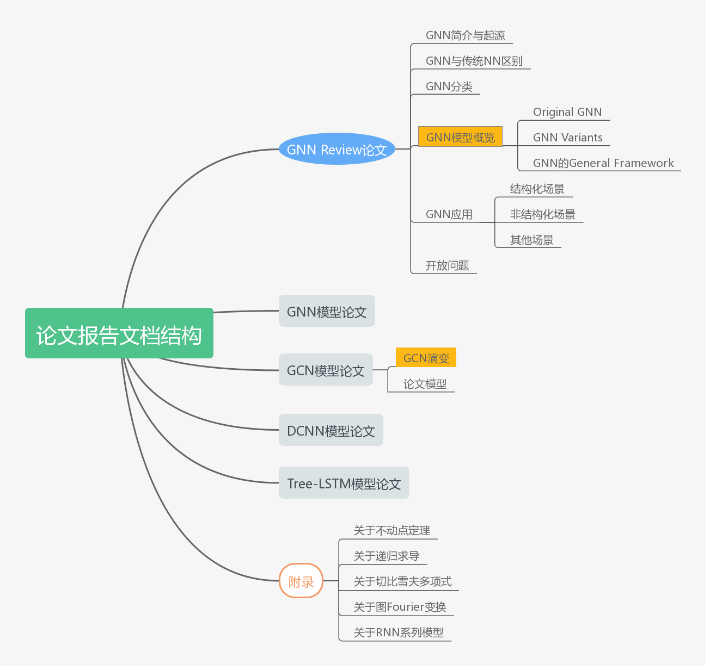

# GNN_Review
GNN综述阅读报告，报告涵盖有多篇GNN方面的论文，以及一个按照论文《The Graph Neural Network Model 》使用pytorch编写的模型例子，该模型在人工数据上进行运行和验证。项目仓的结构树为

```
|-/GNN_Review.md         # GNN综述Markdown文档
|-/GNN_Review1.1.pdf     # GNN综述PDF版文档
|-/README.md             # README文档
|-/GNN示例代码/           # 示例代码文档
  |-images/              # 示例图像
  |-GNN实例.ipynb         # .ipynb文件(可直接使用jupyter运行)
  |-node_dict.json       # 中间的字典文件
|-/pic/                  # GNN综述相关图片
|-/PyG和Pytorch实现GNN模型 # PyG和Pytorch的GNN模型实现文档和代码
  |-cora/                # cora数据集
  |-pic/                 # 文档图片
  |-data/                # 数据集文件夹
  |-Cora数据集.md         # Cora数据集介绍文档
  |-GNN_Implement_with_Pytorch.ipynb  # 使用Pytorch实现GCN和Linear GNN示例
  |-GNN_Implemet_with_PyG.ipynb   # 使用PyG实现GCN示例
  |-GNN与子图匹配.ipynb    # GNN的子图匹配示例
  |-GNN的Batch示例.ipynb  # GNN训练的Batch实现示例
  |-PyG.md               # PyG框架阅读报告
```

+ GNN_Review报告的结构如下

  

